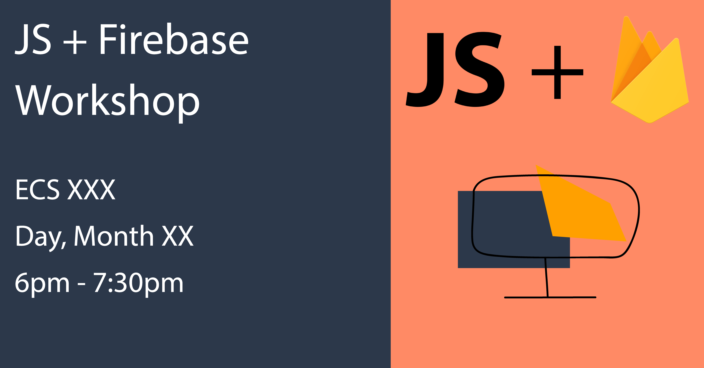

# JS and Firebase Tutorial :raising_hand:

The tutorial will cover how to create an application with JS and Firebase. We will be using vanilla JavaScript and Google Firebase (Firestore, Hosting).  

This tutorial was created to be presented at a UVic Web Dev Club Workshop during the Summer 2019 Term.

Here is the [live demo](https://js-firebase-tutorial-77077.web.app/) feel free to create an account and play around.



## Requirements :full_moon_with_face:

These are the requirements you will need to be able to complete the tutorial. 

#### Hardware :volcano:

* Computer (Admin Access) and Charger
* Pen and Paper (Optional)

#### Accounts :milky_way:

* GitHub Account
* Google Account (Firebase Access)

#### Software :lizard:

* Terminal
* Text Editor (VSCode, Atom, Sublime)
* Browser (Chrome, Firefox, Safari)

#### Tools :pill:

Please have `Git` and `Node.js`/`npm` installed before the tutorial. 

Feel free to install the `Firebase CLI` but we will go over this step in the tutorial. 

* [Git](https://git-scm.com/)
* [Node.js](https://nodejs.org/en/) and [npm](https://www.npmjs.com/get-npm)
* [Firebase CLI](https://firebase.google.com/docs/cli) - `npm install -g firebase-tools`

## Learning Outcomes :pencil2:

By the end of the tutorial you should be able to...

* Use Firebase as a database.
* Use Firebase CLI to deploy your application.
* Recreate the base application locally.
* Deploy the base application to Firebase Hosting.
* Understand the process of creating a JS and Firebase Application. 

## Getting started :scroll:

### Obtain a Local Copy :gem:

1. Open the terminal

2. Change to your working directory

```bash
cd working/directory
```

3. Clone the demo repository

```bash
git clone https://github.com/FlyteWizard/js-firebase-tutorial.git
```

4. Change into the cloned demo repository

```bash
cd js-firebase-tutorial
```

5. Open the demo project in your browser

```bash
// From the terminal
open public/index.html

// Or by double clicking the public/index.html file in Finder
// Or by dragging and dropping the public/index.html file into a browser
```

6. Open the demo project in your text editor

```bash
// From the terminal with VSCode
code .

// Or by opening the project folder within your text editor
```

## Firebase Setup :art:

Here are the docs I reference throughout the tutorial: [https://firebase.google.com/docs/web/setup](https://firebase.google.com/docs/web/setup)

1. Signin to Firebase - [https://firebase.google.com/](https://firebase.google.com/)

2. Go to Console - [https://console.firebase.google.com/](https://console.firebase.google.com/)

3. Create a Firebase Project - [Reference Docs](https://firebase.google.com/docs/web/setup?authuser=0#create-project)

```
	- Select Add a Project
	- Name of Project (Custom - AppName)
	- Project ID (Default)
	- Analytic Zone (Custom - Canada)
	- Firestore Zone (Default - nam5 (us-central))
	- Accept Google Analytics
	- Accept Google Conditions
	- Select Create a Project
	- Select Continue
```

4. Click the Web Icon (`</>`) in the Project Dashboard

5. Register Application - [Reference Docs](https://firebase.google.com/docs/web/setup?authuser=0#register-app)

```
	- Name of Application (Custom - AppName)
	- Configure Hosting (Custom - Check)
	- Deployement (Default)
	- Select Register Application
```

6. Add Firebase SDKs from CDN - [Reference Docs](https://firebase.google.com/docs/web/setup?authuser=0#add-sdks-initialize)

```
	- Core SDK
	- Auth SDK
	- Firestore SDK
```

Add these links to the bottom of the page of every page that will use Firebase. 

```html
<!-- Firebase -->
<script src="https://www.gstatic.com/firebasejs/6.1.0/firebase-app.js"></script> <!-- Core Firebase SDK-->
<script src="https://www.gstatic.com/firebasejs/6.1.0/firebase-auth.js"></script> <!-- Auth Firebase SDK -->
<script src="https://www.gstatic.com/firebasejs/6.1.0/firebase-firestore.js"></script> <!-- Firestore Firebase SDK -->
```

7. Initialize Firebase App - [Reference Docs](https://firebase.google.com/docs/web/setup?authuser=0#config-object)

This will be what we replace with are own Firebase Config.

```js
var firebaseConfig = {
  apiKey: "api-key",
  authDomain: "project-id.firebaseapp.com",
  databaseURL: "https://project-id.firebaseio.com",
  projectId: "project-id",
  storageBucket: "project-id.appspot.com",
  messagingSenderId: "sender-id",
  appID: "app-id"
};
```

How to find your Firebase Config

```
	- Firebase Console Sidebar
	- Select the Cog Icon
	- Select Settings
	- Select General Tab
	- Under Your Application Section
	- Under Firebase SDK snippet Section
	- Select Configuration
	- Copy Configuration
```

This script appears after the SDK scripts 

```html
<script>
  // Firebase Config
  // Replace with the configuration copied above
  const firebaseConfig = {
    apiKey: "api-key",
    authDomain: "project-id.firebaseapp.com",
    databaseURL: "https://project-id.firebaseio.com",
    projectId: "project-id",
    storageBucket: "project-id.appspot.com",
    messagingSenderId: "sender-id",
    appID: "app-id"
  };
  // Initialize Firebase
  // Do not replace :D
  firebase.initializeApp(firebaseConfig);
</script> <!-- Initialize Config and Firebase -->
```

8. Enable Email Signup - [Reference Docs](https://firebase.google.com/docs/auth/web/start)

```
	- Firebase Console Sidebar
	- Underneath Developer Tab
	- Select Authentication
	- Select Connection Method Tab
	- Select Email and Password
	- Select Activate Toggle
	- Select Save
```

9. Create a Firestore Database - [Reference Docs](https://firebase.google.com/docs/firestore)

```
	- Firebase Console Sidebar
	- Underneath Developer Tab
	- Select Database
	- Select Create a Firestore Database
	- Select Test Mode
	- Select Activate
```

10. Create a Collection

```
	- Firebase Console for Database
	- Select Add a Collection
	- Add Collection ID (Custom)
	- Select Next
	- Document ID (Default)
	- Add Fields (Custom) (Field - Type - Value)
	- Select Save
```

## Tutorial - Hands On :crown:

Now that Firebase is Setup and Integrated into our application we can move forward with creating our application. 

You will see certain parts commented out, we will uncomment these sections in order to get our application to work.

There are certain parts labelled `Advance`, these sections of code are reserved for the bonus section of this tutorial. If we are able to get through all the basic examples, we can progress to the more complex. Alternatively, these can be experiemented with after the tutorial. (N.B. I strongly encourage you look through the advance section once the tutorial is over). 

## Deployment :rice_cracker:

1. Secure Firestore Database - [Reference Docs](https://firebase.google.com/docs/firestore/security/overview?authuser=0)

Before we deploy our application, we need to secure the Firestore Database. The following code snippet allows read and write access to all authorize users.

```
service cloud.firestore {
  match /databases/{database}/documents {
    match /{document=**} {
      allow read, write: if request.auth.uid != null;
    }
  }
}
```

```
	- Firebase Console for Database
	- Select Rules Tab
	- Start Typing in the Code Block
	- Copy above code snippet into the Code Block
	- Select Publish
```

2. Install Firebase CLI - [Reference Docs](https://firebase.google.com/docs/web/setup?authuser=0#install-cli_deploy)

If you have not yet installed the Firebase Tools CLI, please copy and paste the below snippet into your terminal.

```bash
npm install -g firebase-tools
```

3. Login to Firebase - [Reference Docs](https://firebase.google.com/docs/hosting/quickstart?authuser=0#initialize)

```bash
firebase login
```

4. Initialize Firebase Application - [Reference Docs](https://firebase.google.com/docs/hosting/quickstart?authuser=0#initialize)

```bash
firebase init
```

Follow the format below

```
// Select
	- Firestore
	- Hosting

// Select
	- Project

// Select
	- Default (firestore.rules)

// Select
	- Default (firestore.indexes.json)

// Select
	- Default (public)

// Select
	- No (Single Page App)

// Select
	- No (Overwrite)
```

5. Deploy Application - [Reference Docs](https://firebase.google.com/docs/hosting/quickstart?authuser=0#initialize)

```bash
firebase deploy
```

6. Visit your Application - [Reference Docs](https://firebase.google.com/docs/hosting/quickstart?authuser=0#deploy)

Your application will be available at either `projectID.web.app`
or `projectID.firebaseapp.com`

## What did I use? :ice_cream:

* Firebase - [https://firebase.google.com/](https://firebase.google.com/)
* GitHub - [https://github.com/](https://github.com/)
* Bootstrap 4 - [https://getbootstrap.com/](https://getbootstrap.com/)
* Vanilla JS - [https://developer.mozilla.org/en-US/docs/Web/JavaScript](https://developer.mozilla.org/en-US/docs/Web/JavaScript)

## Reference Docs :gear:

* Bootstrap - [https://getbootstrap.com/docs/4.3/getting-started/introduction/](https://getbootstrap.com/docs/4.3/getting-started/introduction/)
* Firebase Get Started - [https://firebase.google.com/docs/web/setup](https://firebase.google.com/docs/web/setup)
* Firebase Auth - [https://firebase.google.com/docs/firestore/security/get-started](https://firebase.google.com/docs/firestore/security/get-started)
* Firebase Firestore Data - [https://firebase.google.com/docs/firestore/manage-data/structure-data](https://firebase.google.com/docs/firestore/manage-data/structure-data)

## Further Reading :factory:

* https://www.codementor.io/cultofmetatron/when-you-should-and-shouldn-t-use-firebase-f62bo3gxv
* https://pamartinezandres.com/lessons-learnt-the-hard-way-using-firebase-realtime-database-c609b52b9afb
* https://www.quora.com/What-are-some-good-uses-for-Firebase
